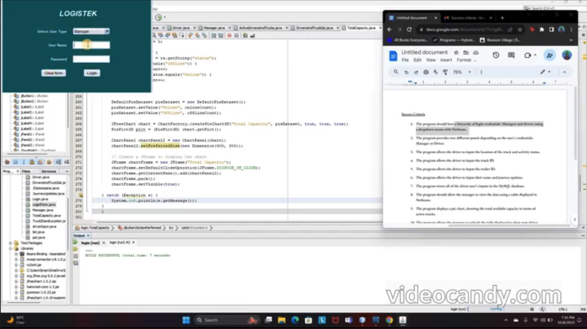

# LogiStik

> Java-based truck & driver management system with role-based login, MySQL persistence, and real-time dashboards.  
> Solo project: my very first coding project before starting college :)

---

## Table of Contents

1. [Overview](#overview)  
2. [Features](#features)  
3. [Tech Stack](#tech-stack)  
4. [Prerequisites](#prerequisites)  
5. [Usage](#usage)  
6. [Demo Video](#demo-video)  
7. [Contact](#contact)  

---

## Overview

LogiStek replaces Excel and paper logs with a desktop GUI that lets managers track truck locations, capacities, and driver updates in real time. Drivers log in to update journey details; managers view and filter inputs, and visualize fleet capacity with pie charts.

---

## Features

- **Role-Based Login**: separate Manager and Driver panels  
- **Driver Panel**: input truck/trailer IDs, location, status, and notes  
- **Manager Dashboard**:  
  - tabular view of all driver inputs  
  - dynamic filtering by truck, driver, or status  
  - pie-chart visualization of available capacity (JFreeChart)  
- **MySQL Backend**: JDBC for reliable, typed storage  
- **MVC Architecture**: clean separation of UI, data, and logic  

---

## Tech Stack

- **Language & IDE**: Java 11+, NetBeans  
- **GUI**: Java Swing  
- **Database**: MySQL (via JDBC)  
- **Charts**: JFreeChart  
- **Packaging**: executable JAR  

---

## Prerequisites

- Java Runtime (JRE) 11 or newer  
- MySQL server (create a database/schema before running)  
- (Optional) NetBeans for source development  

---

## Usage

1. **Login**  
   - Launch the JAR and choose **Manager** or **Driver** role  
   - Enter your username and password  
2. **Driver Workflow**  
   - Fill in truck ID, trailer ID, current location, status, and notes  
   - Click **Submit** to save data to MySQL  
3. **Manager Workflow**  
   - View all driver entries in the table  
   - Use filters (truck, driver, status) to narrow results  
   - Click **Show Chart** to view capacity distribution pie chart  

---

## Demo Video

Watch the full demo on Google Drive:  

  

---

## Contact

Brian Maina – [github.com/brianmmaina](https://github.com/brianmmaina) – bmmaina@bu.edu  
